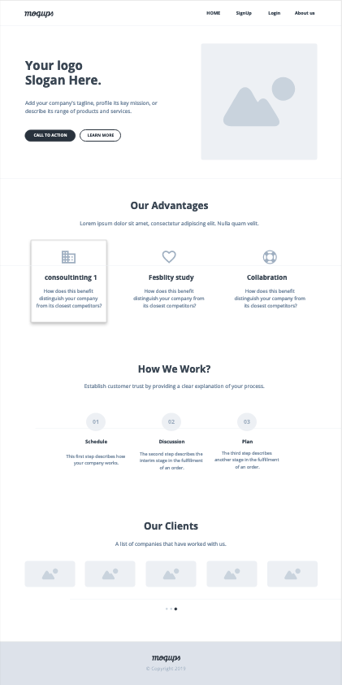
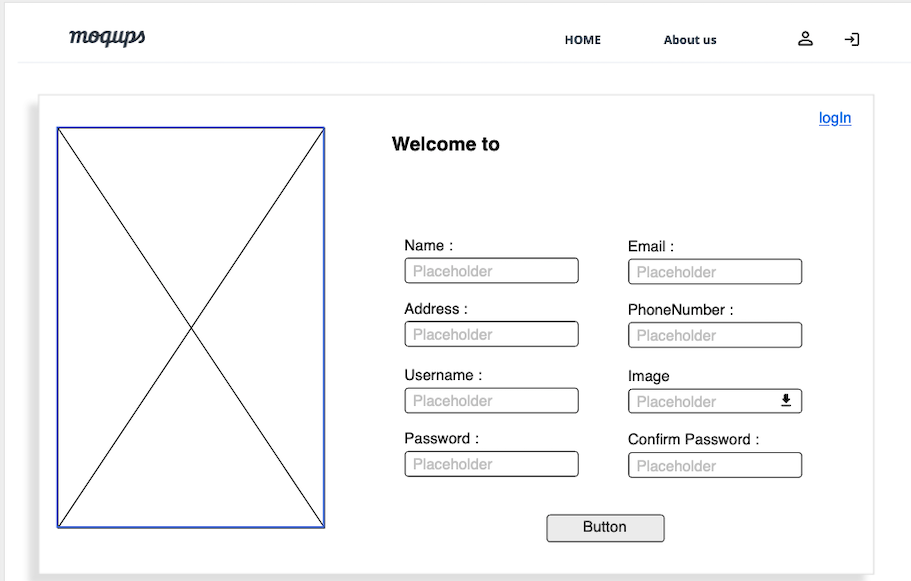
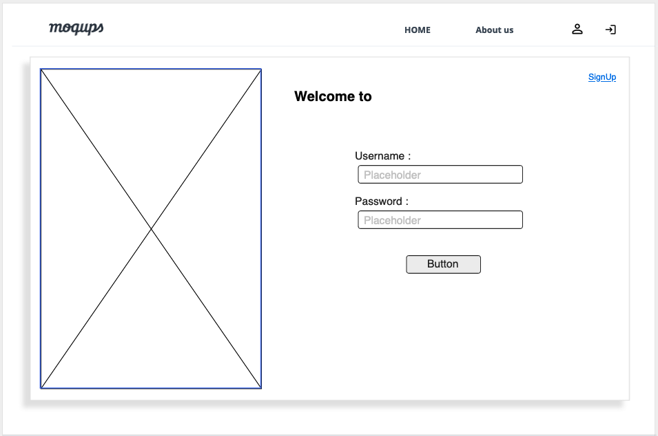
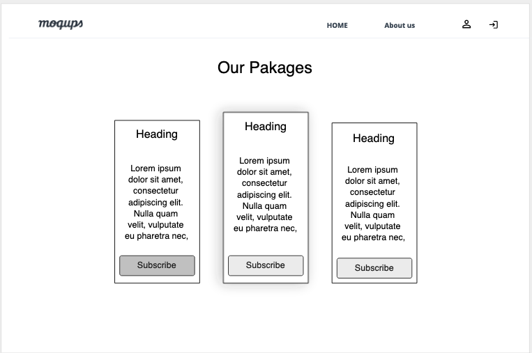
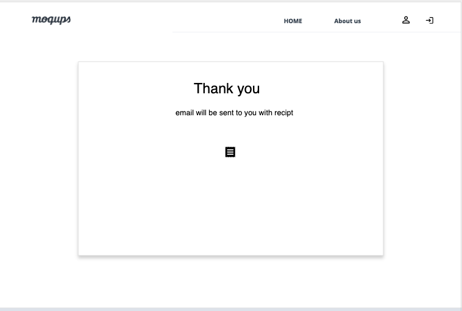
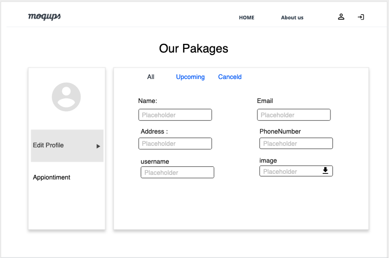
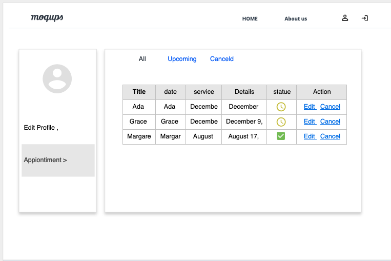

<p align="center">
 
</p>

Advisor Plan is the perfect place where you can start your own company. There are several packages with varity in price and services. Services includes consultation and feasibility study with booking at least an appointment for each service! The appointments are flexable and can be updated anytime. 

## Description

### Registrantion 
The visitor shall be able to create a new account and recive a welcome email. In case the user forget the password, the user will recive an email to reset the password. 

### Services 
The user shall be able to login and buy a package with a credit card. The package has different services. user  shall be able to book appointments depending on the available number of appointments in that package. 


### Profile 
In the profile, user shall be able to view all own packages and appointments. In addition, user shall be able to view and edit own information.

### Wireframes

<details>
<summary>Wireframes</summary>









</details>


### User Stories

- as a user I want to be able to securely sign up so I can login
- as a user I want to be able to securely sign in so I can Buy a package
- as a user I want to be able to securely pay for a package so I can use the avaliable services 
- as a user I want to be able to securely sign in so I can book an appointment of consultation
- as a user I want to be able to securely sign in so I can book an appointment of feasibility study 
- as a user I want to be able to view my profile so I can see my packages
- as a user I want to be able to view my profile so I can see my package details
- as a user I want to be able to view my profile so I can see my appointments
- as a user I want to be able to edit my profile so I can upload image
- as a user I want to be able to edit my profile so I can change my email
- as a user I want to be able to edit my profile so I can securely change password
- as a user I want to be able to edit my profile so I can change my name
- as a user I want to be able to reset my password by email so I log in


### User Stories

User must be able to:
- Create an account
- Login to the website
- View packages
- View information
- Edit profile
- Edit appointment
- Add appointment


## Planning and Development Process

- Brainstorming
- Planning for the project
- Collecting the Requirements
- Designing and prototyping 
- Building the models 
- Developing 
- Testing 
- Deployment

### Problem-Solving Strategy

Wroking as team and whenever one of us stuck in a problem, she will ask for help and we will help her to solve problem. And not to forget to mention that we have the BEST instrctors we can refer to. 

### Unsolved problems

we tried to make the appointments' times showed depending on the free times directly from the database. we have implemented most of the algorithm, but still having problems unsolved 


### Technical Used

- [Wireframe](https://moqups.com/)
- Frontend: REACT.js
- Backend: Express.js
- Databse: MongoDB, Mongoose
- VS Code editor

## Installation Instructions


1. Clone the repository:
```
$ git clone https://git.generalassemb.ly/Overflow/project4_overflow.git
$ cd project4_overflow
```


2. Start the backend server:
```
$ cd frontend 
// install dependencies
$ npm i 
// start the server
$ nodemon  
```

3. Start the frontend server:
```
$ cd frontend 
// install dependencies
$ npm i 
// start the server
$ npm start 
```

4. Navigate to project locally [Here](http://127.0.0.1:3000/) 


## APIs Used

- [cloudinary](https://cloudinary.com/)


## Live link

- [Advisor Plan](https://advisor-plan-1.herokuapp.com/)


## Acknowledgments

Overflow team would like to express great thanks to the best instructors: Marco Santonastasi, Yasir Al-Muhtrish, Ali Hamidaddin, Haneen Alghamdi and Sara kuddah for their valuable guidance and support during the development of the project and the whole cladss.


## Future Suggestion and Inhancment

- Fix problems and clean the code. 
- Add more features like the chat bot.
- Enhance the user experience and add animation.
- Add extra packages and services 


 ## References
- [react-calendar](https://www.npmjs.com/package/react-calendar)
- [react-credit-cards](https://www.npmjs.com/package/react-credit-cards)
- [nodemailer](https://www.npmjs.com/package/nodemailer)
- [mongoose](https://mongoosejs.com/docs/)

